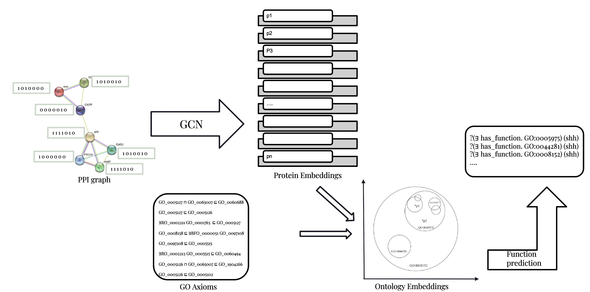
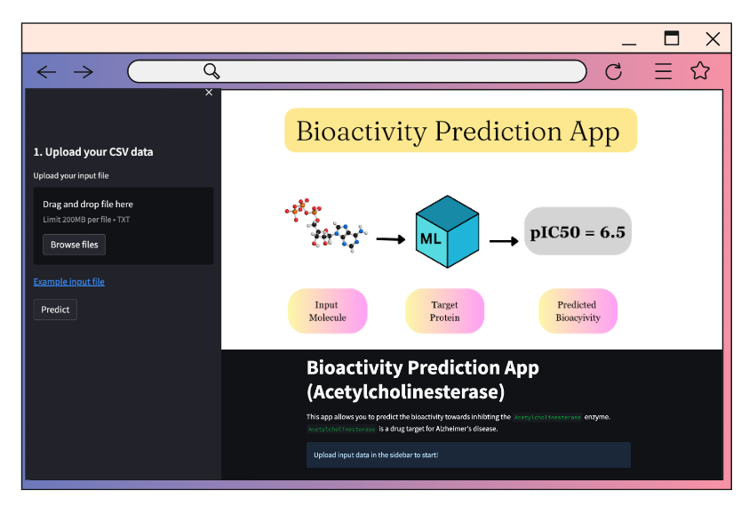
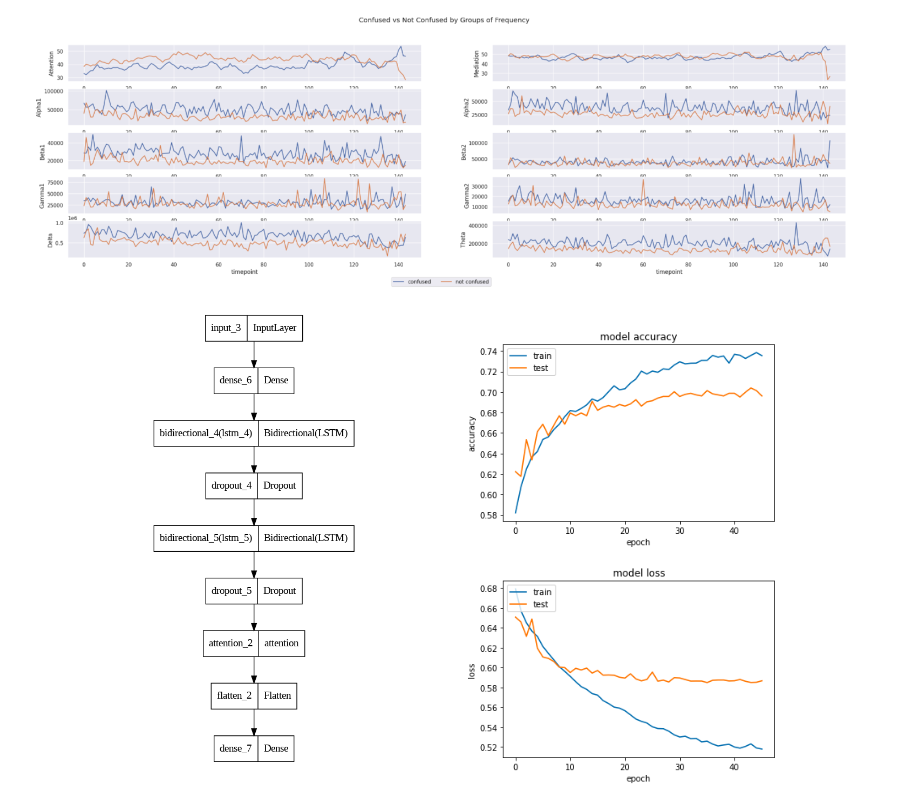
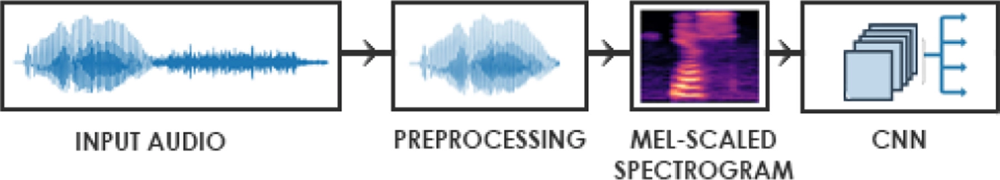
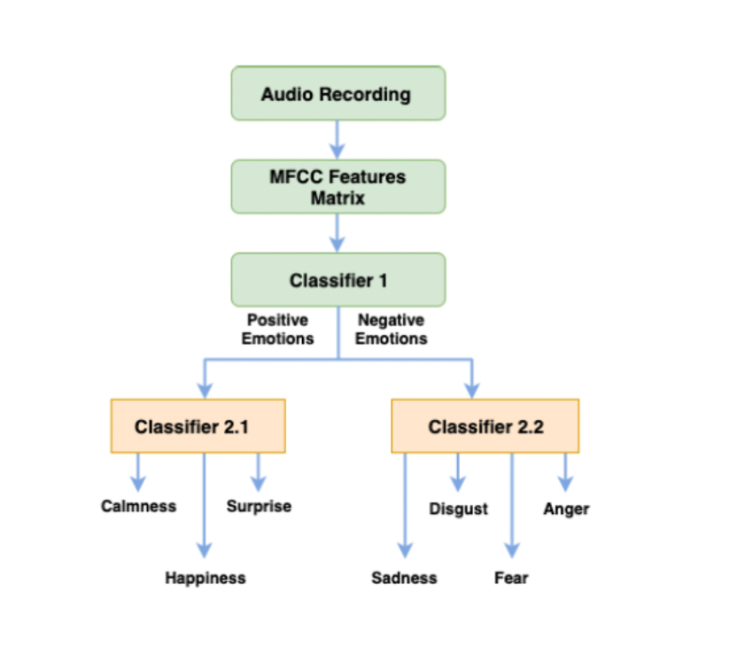

# Portfolio
---

## Published and Presented Work

### Predicting Protein Functions From Interactions Using Graph Neural Networks and Ontologies

Masters Thesis by Shahad Qathan. Supervised by Dr. Robert Hoehndorf (2022).

 

To understand the process of life, it is crucial for us to study proteins and their functions. Proteins execute (almost) all cellular activities and their func- tions are standardized by Gene Ontology (GO). The amount of discovered pro- tein sequences grows rapidly as a consequence of the fast rate of development of technologies in gene sequencing. In UniProKB, there are more than 200 million proteins. Still, less than 1% of the proteins in the UniProtKB database are exper- imentally GO-annotated, which is the result of the exorbitant cost of biological experiments. To minimize the large gap, developing an efficient and effective method for automatic protein function prediction (AFP) is important.

 

 

### Recent Advances and Machine Learning Techniques on Sickle Cell Disease

Alharbi, Noorh H.; Bameer, Rana O.; Geddan, Shahad S.; and Alharbi, Hajar M. (2020)

 

Sickle cell disease is a severe hereditary disease caused by an abnormality of the red blood cells. The current therapeutic decision-making process applied to sickle cell disease includes monitoring a patient’s symptoms and complications and then adjusting the treatment accordingly. This process is time-consuming, which might result in serious consequences for patients’ lives and could lead to irreversible disease complications. Artificial intelligence, specifically machine learning, is a powerful technique that has been used to support medical decisions. This paper aims to review the recently developed machine learning models designed to interpret medical data regarding sickle cell disease. To propose an intelligence model, the suggested framework has to be performed in the following sequence. First, the data is preprocessed by imputing missing values and balancing them. Then, suitable feature selection methods are applied, and different classifiers are trained and tested. Finally, the performing model with the highest predefined performance metric over all experiments conducted is nominated. Thus, the aim of developing such a model is to predict the severity of a patient’s case, to determine the clinical complications of the disease, and to suggest the correct dosage of the treatment(s).

 
---

## Personal Projects

### Analyzing Activity in Mouse Brain

flalalalala.

 

 

### Computational Drug Discovery for SARS-CoV-2

flalalalala.

 

 

### Computational Drug Discovery - Bioactivity Prediction App (Acetylcholinesterase)

flalalalala.

 

 

### Analysis of EEG of Confused Students

The primary cause of poor performance of students during the learning process is confusion. To make online education more effective, it is important to detect confusion in real-time. While online education caters to a large number of students simultaneously, it has certain drawbacks in comparison to traditional in-class education. Currently, attempts are being made to enhance communication between instructors and students through interactive tools. Pervious work has shown the effectivness of applying bidirectional LSTM on type of data. I expermint with variations of LSTM as reported in the most recent works to improve on the current state of the art.

 

 

### Analysis and Detection of Emotions Expressed Vocally Using Convolutional Neural Networks

Emotion plays a significant role in the way humans understand the true meaning of human-spoken languages. The emotion implicitly expressed by a speaker can change the entire underlying meaning of a sentence. Thus, many studies have investigated methods to identify the speaker’s emotions of spoken languages automatically. This task is very challenging, even for humans, and requires some expertise due to the subtle differences between some emotions (e.g., surprise and anger). Automatic Speech Emotion Recognition (SER) is an application of Artificial Intelligence, where Machine Learning models are used to predict the emotion expressed by speakers (Kerkeni et al., 2019). In this work, we use a hierarchical classification approach to see if it can improve the performance of the classical 1-level classifiers in predicting emotions expressed in speech.

 

 

---

---

